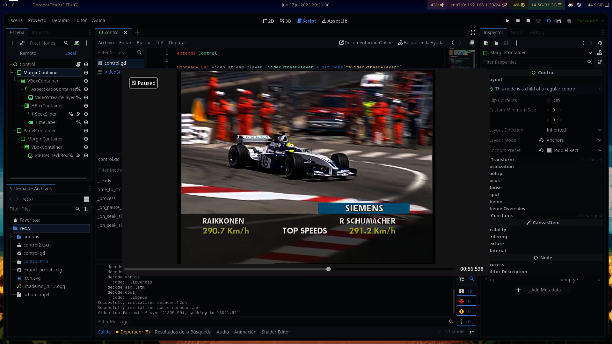

# EIRTeam.FFmpeg

Note: The version of FFmpeg shipped with EIRTeam.FFmpeg allows loading of videos using the patent-encumbered h264 codec, check with your local laws to see if software patents are recognized in your country.

GDExtension Video Decoder library for [Godot Engine](https://godotengine.org) >4.1,
using the [FFmpeg](https://ffmpeg.org) library.

# Documentation

The official documentation can be found [here](https://eirteam-docs.readthedocs.io/en/latest/documentation/ffmpeg/ffmpeg_getting_started.html).

# Supporting development

You can also support EIRTeam by donating on [Patreon] or purchasing [Project Heartbeat](https://store.steampowered.com/app/1216230/Project_Heartbeat/).

[Patreon]: https://www.patreon.com/EIRTeam